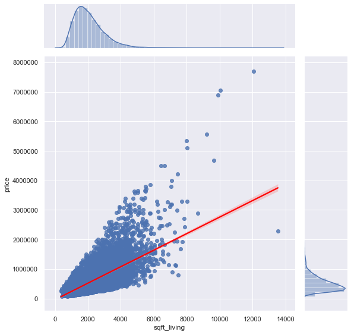
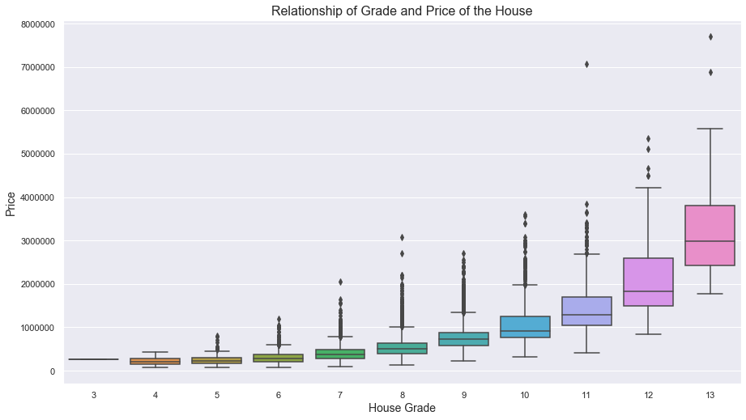
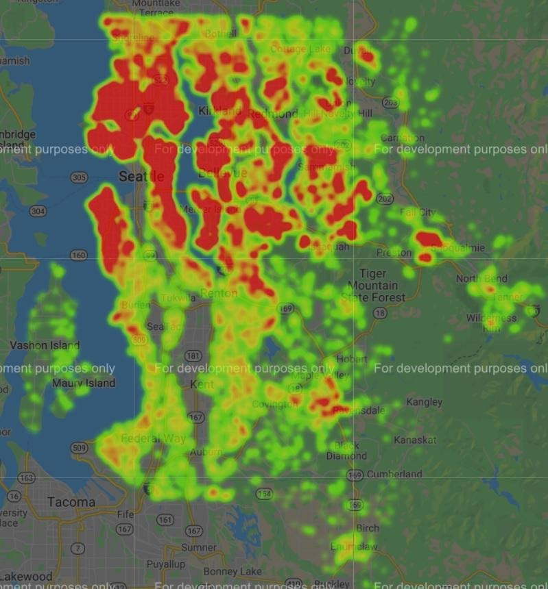

# PCS House Price Guide Kings County, WA

**By**: Jinsol Cantrall
****
## Overview
The dataset describes house sales in Kings County, Washington. I have decided to use this dataset to develop a price prediction. This dataset included house sale price with multiple variables such as number of bedrooms/bathrooms, date of sale, location information, size of the house, and condition of the house.

## Business Problem
VA loans offers many military veterans and members a great opportunity to buy a house. However, buying a house can be very confusing since most of us are new to the area. Even with the listed price online, it seems like each house has its own assessor. With this great opportunity, we can estimate the fair price of the house when you are buying or selling. Also, when we are selling, what factor would affect the price of the house.

## Data
The dataset ('kc_house_data.cvs') contains list of house sale in Kings County, WA. This dataset include the target variable 'price' and 20 other variables that will affect the target variable.

## Methods
Used OSEMN Method:

- Obtain
- Scrub
- Explore
- Model
- iNterpret

## Results
My first simple model started with one independent variable ‘sqft_living’. First model had an r-squared of 0.492. This model violated the linearity , normality, and homoscedasticity assumptions of linear regression (p<0.001 for all tests). Since it was the only feature, it met the independence assumption. 

The final model had 14 input features : ‘sqft_living’, ‘bathrooms’, ‘sqft_lot’, ‘sqft_above’, ‘sqft_living15’, ‘sqft_lot15’, ‘yr_built’, ‘waterfront’, ‘bedrooms’, ‘floors’, ‘view’, ‘condition’, ‘grade’, ‘zipcode’. The final model had improved r-squared from 0.492(first simple model) to 0.655. However, this model still violated linearity assumption (p>0.05), normality (p<0.001) and homoscedasticity (p<0.001) assumptions. It also violated the independence assumption.

1. Does sqft_living affect the price of the house? 

    Yes. with 65.5% of the variance in price. More analysis would help raise the accuracy of the model. $167.52 per sqft_living was measured. 

2. Does having more ‘bathroom’ increase the sale price of the house? 

    Yes. For each number of bathrooms, the price increases by $66,370.

  ###  sqft living vs price.

### Grade seems like it affects the price of the house greatly.

### As the house is closer to the Seattle, the price of the house is increased.

